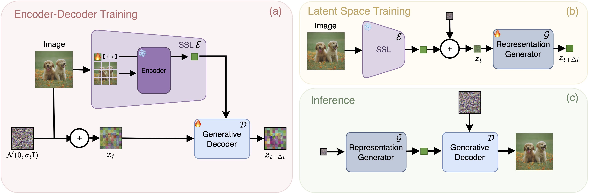
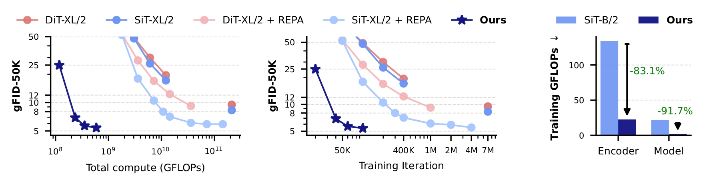
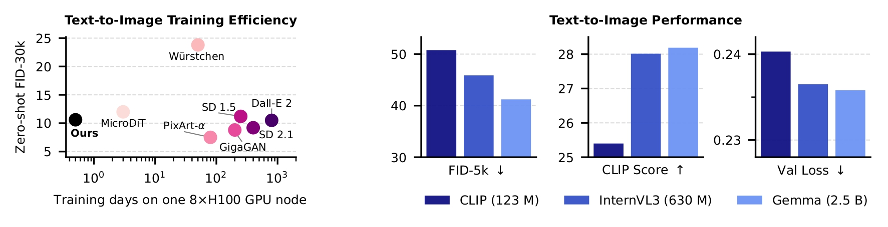
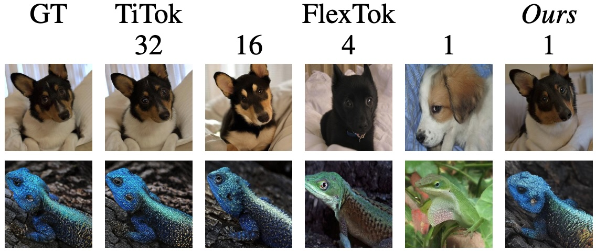
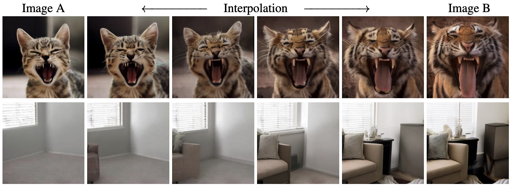
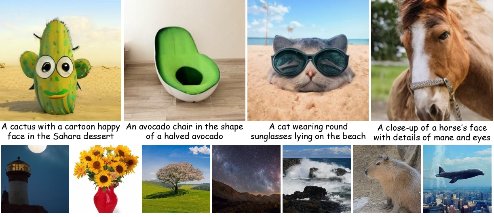

<div align="center">
<p align="center">
 <h2 align="center">🦎 Adapting Self-Supervised Representations as a Latent Space for Efficient Generation</h2>

<p>
  Ming Gui<sup>*1,2</sup> · Johannes Schusterbauer<sup>*1,2</sup> · Timy Phan<sup>1,2</sup><br>Felix Krause<sup>1,2</sup> · Josh Susskind<sup>3</sup> · Miguel A. Bautista<sup>3</sup> · Björn Ommer<sup>1,2</sup><br>
  <b>
  <br>
    <sup>1</sup>CompVis Group @ LMU Munich &nbsp;&nbsp;&nbsp;
    <sup>2</sup>MCML &nbsp;&nbsp;&nbsp;
    <sup>3</sup>Apple
  </b>
  <p align="center"> <sup>*</sup> <i>equal contribution</i> </p>
  <b> ICLR 2026 </b>
</p>

<a href="https://arxiv.org/abs/2510.14630" target="_blank">
  
</a>

</div>

# 🔥 TL;DR

We introduce **Rep**resentation **Tok**enizer (RepTok🦎), a generative framework that encodes each image into a single continuous latent token derived from self-supervised vision transformers. By jointly fine-tuning the semantic `[cls]` token with a generative decoder, RepTok achieves faithful reconstructions while preserving the smooth, meaningful structure of the SSL space. This compact one-token formulation enables highly efficient latent-space generative modeling, delivering competitive results even under severely constrained training budgets.

# 📝 Overview

Our approach builds on a pre-trained SSL encoder that is lightly fine-tuned and trained jointly with a generative decoder. We train the decoder with a standard flow matching objective, complemented by a cosine-similarity loss that regularizes the latent representation to remain close to its original smooth and semantically structured space, which is well-suited for generation. Without auxiliary perceptual or adversarial losses, the resulting model is able to faithfully decode the single-token latent representation into the pixel space.

<p align="center">

</p>

This design enables highly efficient image synthesis training, allowing us to use simple, attention-free architectures such as MLP-Mixers for accelerated ImageNet training. Furthermore, we show that the framework naturally extends to text-to-image (T2I) synthesis: by incorporating cross-attention to integrate textual conditioning, our model achieves competitive zero-shot performance on the COCO benchmark under an extremely constrained training budget.

# 📈 Results

## ⏳ Efficiency

Our approach constantly achieves a substantially lower computational footprint while maintaining competitive performance on ImageNet.

<p align="center">

</p>

This also extends to a general T2I setting: RepTok reaches SD 1.5 quality in a fraction of the cost of other methods while delivering better generative performance compared to other efficiency-focused methods.

<p align="center">

</p>

## 🌇 Qualitative Reconstructions

Our approach augments the pre-trained SSL representations with additional necessary information to enable images to be faithfully encoded as a single continuous token, which allows for both high-fidelity image reconstruction and synthesis.

<p align="center">

</p>

## 🐯 Interpolation Results

We observe smooth transitions not only in semantic content but also in spatial configuration. This indicates that our method successfully integrates low-level spatial information while preserving the properties of the pretrained encoder's latent space, and facilitates generation within the learned representation.

<p align="center">

</p>

## 🔥 T2I Results

Using our approach, we trained a general T2I model which synthesizes coherent and aesthetically pleasing images with minimal compute budget.

<p align="center">

</p>

# ⚙️ Usage

First, clone this github repo using
```
git clone git@github.com:CompVis/RepTok.git
cd RepTok
```

Download the official checkpoint by running the following command:

```
mkdir -p checkpoints
wget -P checkpoints/ https://ommer-lab.com/files/reptok/reptok-xl-600k-ImageNet.ckpt
```

Set up the environment using the following commands:
```
conda create -n reptok python=3.10
conda activate reptok

pip install -r requirements.txt
```

## Inference
Please refer to `scripts/generation.ipynb` and `scripts/reconstruction.ipynb`.


# 🎓 Citation

If you use our work in your research, please use the following BibTeX entry

```bibtex
@inproceedings{gui2025reptok,
  title={Adapting Self-Supervised Representations as a Latent Space for Efficient Generation}, 
  author={Ming Gui and Johannes Schusterbauer and Timy Phan and Felix Krause and Josh Susskind and Miguel Angel Bautista and Björn Ommer},
  booktitle={The Fourteenth International Conference on Learning Representations (ICLR)},
  year={2026},
  url={https://openreview.net/forum?id=0b6a2SE23v}
}

```